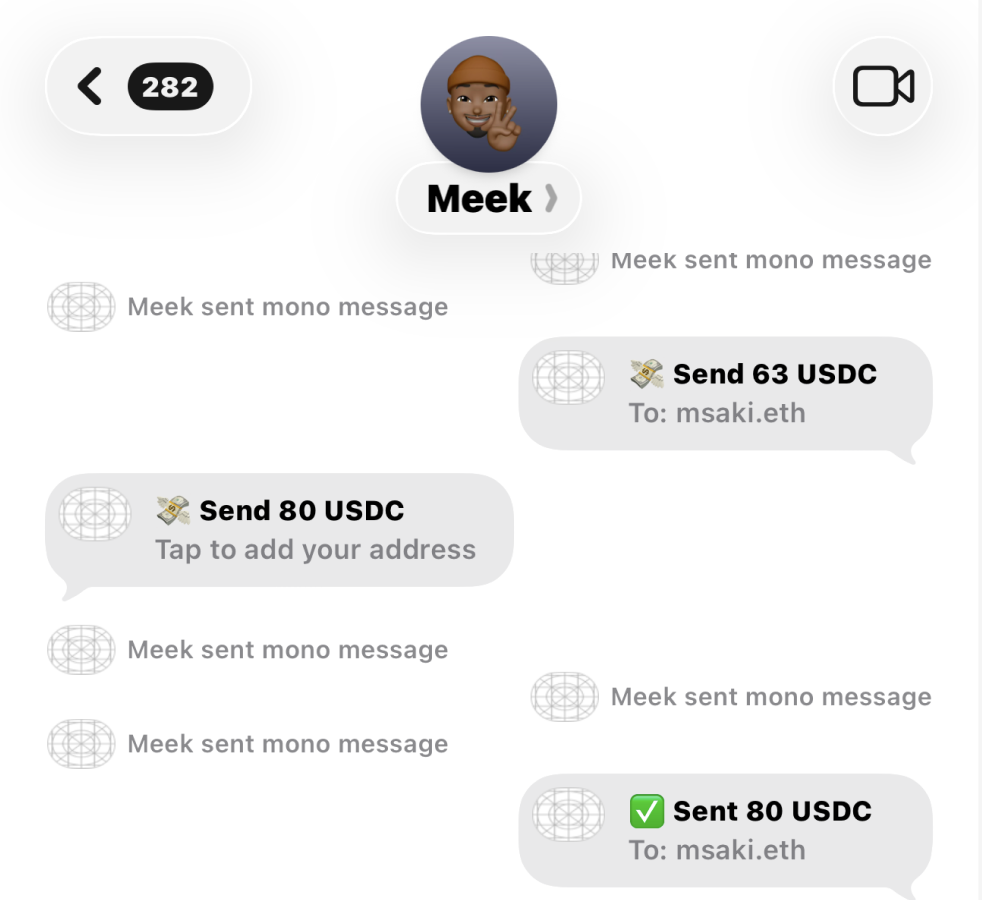

This project is archived. Development moved to [mmsaki/mono](https://github.com/mmsaki/mono)

# iMessageUSDC

The easiest way to send USDC payments from your iPhone via iMessage.

## Overview

iMessageUSDC is an iMessage widget that allows you to send USDC cryptocurrency payments directly within iMessage conversations. No need to switch between apps—just send USDC as easily as sending a sticker or emoji.

## Features

- **Quick Payments**: Send USDC directly from the iMessage app drawer
- **Widget-Based**: Lightweight iMessage app widget integration
- **Secure**: Built with industry-standard cryptocurrency security
- **Fast**: Near-instant transactions on supported networks
- **Simple**: Send payments with just a few taps

## Techinical Details

iMessage apps can:

- Present a custom user interface inside the Messages app; see [MSMessagesAppViewController](https://developer.apple.com/documentation/messages/msmessagesappviewcontroller).
- Create a custom or dynamic sticker browser; see [MSStickerBrowserViewController](https://developer.apple.com/documentation/messages/msstickerbrowserviewcontroller).
- Insert text, stickers, or media files into the Messages app’s input field; see [MSConversation](https://developer.apple.com/documentation/messages/msconversation).
- Create interactive messages that carry app-specific data; see MSMessage.
- Update interactive messages (for example, to create games or collaborative apps); see [MSSession](https://developer.apple.com/documentation/messages/msmessage).

## Requirements

- iOS 17.0 or later
- iPhone device
- A wallet with USDC balance or Create one with privy.

## Installation

1. Clone this repository
2. Open `iMessageUSDC.xcodeproj` in Xcode
3. Configure your development team in the project settings
4. Build and run on a physical device
5. Add iMessageUSDC from the Messages app drawer

## Usage

1. Open any conversation in Messages
2. Tap the Apps button (grid icon) next to the text field
3. Find and tap the iMessageUSDC widget
4. Enter the amount and select a recipient
5. Send the payment

## Configuration

Configure your wallet and network settings in the app settings panel.

## Security

- Private keys are stored securely in the device Keychain or Privy provider
- Transactions require biometric (Face ID/Touch ID) confirmation
- No seed phrases or private keys are ever transmitted

## Contributing

Contributions are welcome! Please open an issue or submit a pull request.

## License

MIT License
